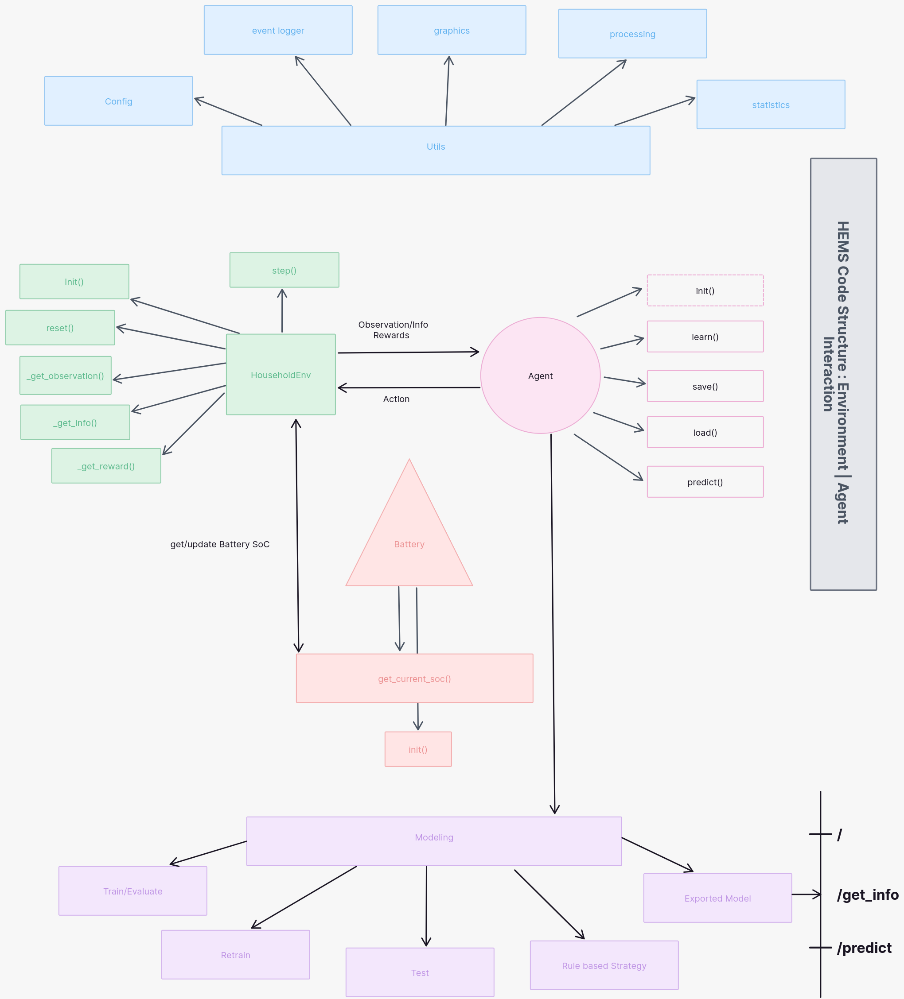

# BEV_V2H_HEMS-RL

## Development instructions

**install dependencies**

```bash
pip install -r requirements.txt
```

**install [custom env.](../hems-env/)  module locally**

```bash
cd ./hems-env && pip install e .
```

**pre-commit hooks**

```bash
pre-commit install
```

`.pre-commit-config.yaml` conditions will be checked for all files

```bash
pre-commit run --all-files
```

## Reproduction instructions

**run train/eval/tests**

```bash
python main.py --model[opt1] --action=[opt2]
```

- `opt1` : [ppo, sac, td3, rbc]
- `opt2` : [train, retrain, test]
- if --model=rbc: --action=<dont care>


**checkpoints/metrics/stats/graphics**

> dir: *src/results/\**


Model Checkpoints: `results/checkpoints/`

- PPO.zip
- SAC.zip
- TD3.zip


Tensorboard Logs: `results/logs/tensorboard/`

- Train metrics : Losses, Parameters, etc.
- Evaluation metrics : Mean Rewards
- Test metrics :
    - Observations (Power Household, Power PV, Battery SoC)
    - Results/Agents (Actions, Exchanges, Rewards)

```bash
tensorboard --logdir=results/logs/tensorboard/
```

Stats CSV Files: `results/stats/`

- Overall total steps Experiences : step_stats.csv
- Episodic total steps Experiences : step_stats_episode[n].csv

Matplotlib Plots: `results/graphics/`

- Train/Evaluation Figures : Mean Rewards
- Test Figures :
    - overall experiences subplots (pw_household, pw_pv, soc, action, exchange, reward/cost)
    - power balance subplots (pw_household, pw_pv, action, exchange)
    - observation relative actions(pw_household, pw_pv, auction_price, soc, action)


**misc scripts in experiments**

```bash
unzip experiments.zip
```

- run individual script/notebooks e.g. hyperparam search : `python optuna_param_search.py`


**Experiments on Device with Specifications:**

```shell
                  -`                     tux@archlinux
                 .o+`                    -------------
                `ooo/                    OS: Arch Linux x86_64
               `+oooo:                   Host: 81SX (Legion Y540-15IRH)
              `+oooooo:                  Kernel: Linux 6.9.10-arch1-1
              -+oooooo+:                 Uptime: 8 hours, 35 mins
            `/:-:++oooo+:                Packages: 987 (pacman), 11 (flatpak)
           `/++++/+++++++:               Shell: zsh 5.9
          `/++++++++++++++:              Display (BOE084D): 1920x1080 @ 144Hz
         `/+++ooooooooooooo/`            WM: i3 (X11)
        ./ooosssso++osssssso+`           Cursor: Adwaita
       .oossssso-````/ossssss+`          Terminal: alacritty 0.13.2
      -osssssso.      :ssssssso.         Terminal Font: BlexMono Nerd Font (11.0pt)
     :osssssss/        osssso+++.        CPU: Intel(R) Core(TM) i7-9750H (12) @ 4.50 GHz
    /ossssssss/        +ssssooo/-        GPU: NVIDIA GeForce RTX 2060 Mobile [Discrete]
  `/ossssso+/:-        -:/+osssso+-      Memory: 6.49 GiB / 15.53 GiB (42%)
 `+sso+:-`                 `.-/+oso:     Swap: 0 B / 4.00 GiB (0%)
`++:.                           `-/+/    Disk (/): 102.46 GiB / 467.40 GiB (22%) - ext4
.`                                 `/    Local IP (wlan0): 192.168.178.37/24
                                         Battery: 100% [AC Connected]
                                         Locale: en_US.UTF-8
```


## **Reports**

- [[proposal](./reports/proposal.pdf)]
- [[bi-weekly](./reports/biweekly_reports/)]
    - [[1](./reports/biweekly_reports/report1/)], [[2](./reports/biweekly_reports/report2/)], [[3](./reports/biweekly_reports/report3/)], [[4](./reports/biweekly_reports/report4/)], [[5](./reports/biweekly_reports/report5/)], [[6](./reports/biweekly_reports/report6/)], [[7](./reports/biweekly_reports/report7/)], [[8](./reports/biweekly_reports/report8/)]
- [[final report](./reports/final_report/)]


**project general structure**




## **References**

*literatures*

- [1.] [Proximal Policy Optimization Algorithms](https://arxiv.org/abs/1707.06347)
- [2.] [Addressing Function Approximation Error in Actor-Critic Methods](https://arxiv.org/abs/1802.09477)
- [3.] [Soft Actor-Critic: Off-Policy Maximum Entropy Deep Reinforcement Learning with a Stochastic Actor](https://arxiv.org/abs/1801.01290)
- [4.] [Deep reinforcement learning for the optimized operation of large amounts of distributed renewable energy assets](https://www.sciencedirect.com/science/article/pii/S2666546822000611)


*development*

- [1.] [Farma-Gymnasium](https://github.com/Farama-Foundation/Gymnasium)
- [2.] [Stable-Baselines3](https://github.com/DLR-RM/stable-baselines3)

*docs*

- [[gymnasium](https://gymnasium.farama.org/#)]
- [[stable-baselines3](https://stable-baselines3.readthedocs.io/en/master/index.html)]
- [[matplotlib](https://matplotlib.org/stable/api/index)]
- [[numpy](https://numpy.org/doc/stable/)]
- [[pandas](https://pandas.pydata.org/docs/)]
- [[pre-commit](https://pre-commit.com/)]
- [[structlog](https://www.structlog.org/en/stable/index.html)]
- [[torch](https://pytorch.org/docs/stable/index.html), [tensorboard](https://pytorch.org/tutorials/recipes/recipes/tensorboard_with_pytorch.html)]
