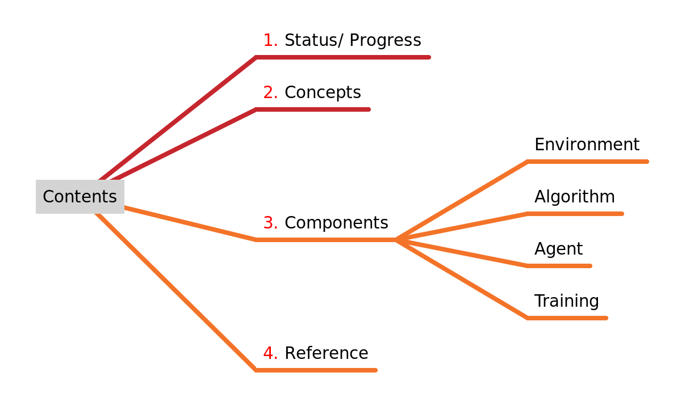
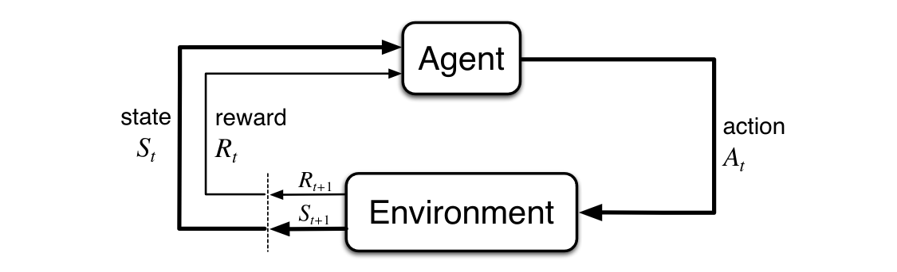
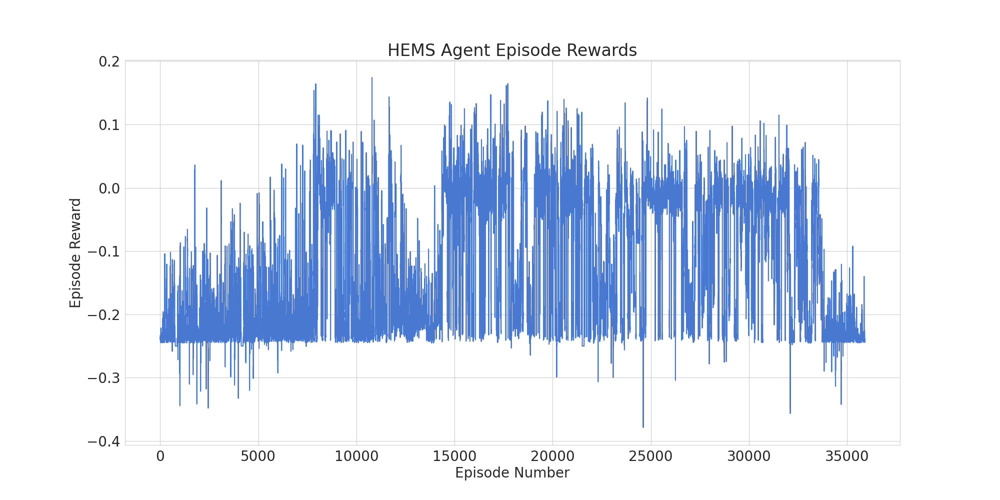
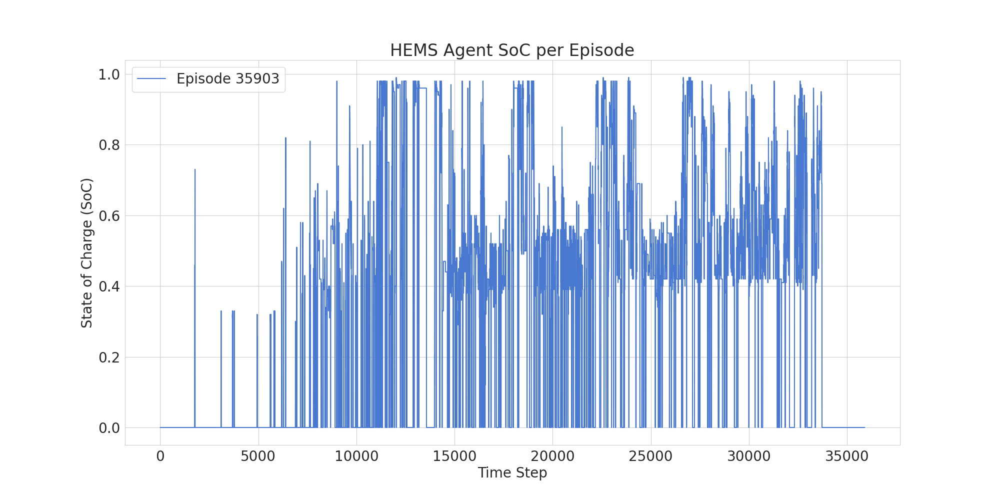
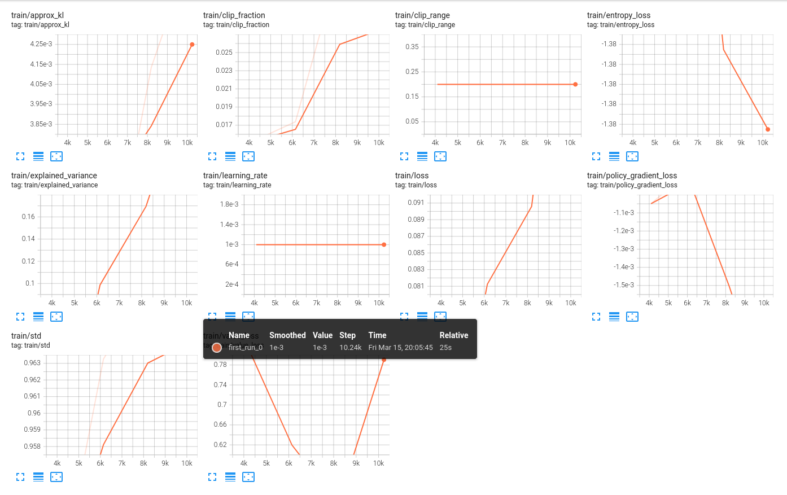

# Training Prosumer Agents with Reinforcement Learning.

***

**>>> Biweekly Report 1.** ( $1^{st} Mar - 15^{th} Mar : 2024$ )

***

***

## 1. Status/ Progress

### Current Iteration

- [x] Fundamental concept of RL
- [ ] Environment Setup
  - [x] Custom Gymnasium Environment
    - [x] Action Space
    - [x] Observation Space
    - [ ] Transition Function
    - [x] Reward Estimation Function
  - [x] Check integration with Stable baseline
- [x] Custom Agent setup with Stable baselines3
- [x] Test train epochs and episodes
- [x] Graphics and Tensorboard Log setup

### Next Iteration (Plan)

- [ ] Confirm transition function
- [ ] Write tests for the implemented units
- [ ] Comparison scenarios with resulting agent actions for evaluation setup
- [ ] ... Feedbacks and remarks

## 2. Concepts

Main concept of reinforcement learning (RL) revolves around an **agent** learning to make decisions in an **environment** through trial and error, with the goal of maximizing a **reward**.  Key components of RL are :

  Fig. Agent-Environment Interaction $_1$

- **Agent:** This is the entity that interacts with the environment. It can be any decision-making system.
- **Environment:** This is the world or system the agent operates in. It provides the agent with feedback in the form of rewards or penalties based on its actions.
- **State:** This represents the current situation in the environment relevant to the agent's
  decision-making. It's like a snapshot of the environment that the agent uses to decide what to do next.
- **Action:** This is what the agent chooses to do in a particular state.
- **Reward:** This is a numerical value assigned to the agent after it takes an action. Positive rewards indicate good choices, while negative rewards indicate bad choices. The reward function guides the agent's learning by shaping its understanding of what actions lead to desirable outcomes.
- **Policy:** This is the strategy the agent uses to map states to actions. Through trial and error, the agent learns and refines its policy to make better decisions in the future.
- The cycle of action, reward, and policy update continues as the agent learns through experience untill some termination or truncation criteria is met.

## 3. Components

### **Environment**

It is a virtual representation of household's energy system. [Gymnasium](https://github.com/Farama-Foundation/Gymnasium)$_2$  library is used to develop custom Environments which then the learning algorithm can interact through APIs.

- Observation Space
- Action Space
- Reward Estimation Function

#### **Observation Space**

Observation space in gymnasium for HEMS environment defines a range of formats of information the agent receives in order to make decisions.

**Information used as System State**

- State of Charge (SoC): Current battery level (e.g., percentage or normalized value)
- Household Demand: Current power consumption of the household (e.g., kW)
- PV Generation: Current power generation from the solar panels (e.g., kW)

**Data Type, Shape, and Range**

- `dtype=np.float32` specifies the data type as 32-bit floating-point numbers.
- shape=(3,) indicates the observation vector contains three elements.
- low specifies the minimum value for each element in the observation vector:
  - `0.0`: Lower bound for normalized SoC (assuming 0 to 1 range)
  - `consumption.min()`: Minimum observed household demand
  - `genentation.min()`: Minimum observed PV generation
  - high defines the maximum value for each element:
  - `1.0`: Upper bound for normalized SoC
  - `consumption.max()`: Maximum observed household demand
  - `generation.max()`: Maximum observed PV generation

#### **Action Space**

The action space in a gymnasium environment defines the range and format of actions( control signals ) the agent can take within the environment. An action taken by agent to influence the environment in this case would be *Charging/Discharging Power* i.e. The amount of power to charge or discharge from the battery (e.g., kW). A continuous space is used here.

*Data Type, Shape, and Range*

- `dtype=np.float32` specifies the data type as 32-bit floating-point numbers.
- `shape=(1,)`: Representing a single action value (charging/discharging power)
- `low=-11` and `high=11`: Assuming valid charging/discharging power ranges from -11 kW (discharging) to 11 kW (charging).

#### **Reward Estimation Function**

The reward function plays a crucial role in shaping the agent's behavior in a reinforcement learning environment. In case of HEMS scenario using PPO, we can define a reward function as composition of following Objectives/ Constraints:

##### **Objectives:**

- **Meet household demand:** Ensure the agent prioritizes meeting the household's energy needs.
- **Minimize grid dependence:** Promote self-sufficiency by utilizing PV generation and minimizing reliance on the grid.
- **Maximize battery health:** Encourage the agent to avoid extreme charging and discharging rates that can degrade the battery.

##### **Reward Components:**

**i. PV Generation Utilization:** Reward the agent for using generated solar power to meet demand.

$$
\boxed{
    R_{PV} = min(D, G) \cdot \beta
}
$$

Where,

- $R_{PV}$: PV generation utilization reward
- $D$: Household demand for power (kW)
- $G$: PV generation (kW)
- $\beta$: Weight for PV utilization (positive value)

It rewards the agent for using generated solar power ($G$) to meet demand ($D$). The min function ensures the reward is based on the minimum of these two values, preventing situations where generation exceeds demand. The weight ($\beta$) controls the significance of PV utilization in the overall reward.

**ii. Grid Dependence Penalty:** Penalize the agent for drawing power from the grid, especially during peak demand periods (optional).

$$
\boxed{
    R_{grid} = - \gamma \cdot max(0, D - G)
}
$$

Where,

- $R_{grid}$: Grid dependence penalty
- $\gamma$: Weight for grid dependence (positive value)
- $D$: Household demand for power (kW)
- $G$: PV generation (kW)

It penalizes the agent for drawing power from the grid. The $max(0, D - G)$ ensures the penalty is only applied when demand exceeds generation (positive value). The weight ($\gamma$) determines the severity of the penalty for grid reliance.

**iii. SoC Stability:** Penalize large deviations from a desired SoC range (e.g., reward staying within a comfortable battery level).

$$
\boxed{
    R_{SoC} = -\alpha |SoC - SoC_{desired}|
}
$$

Where,

- $R_{SoC}$: SoC stability reward
- $\alpha$: Weight for SoC stability (positive value)
- $SoC$: Current state of charge of the battery (0 to 1)
- $SoC_{desired}$: Desired SoC range center (e.g., 0.5 for a range of 0.2 to 0.8)

The higher the weight ($\alpha$), the stricter the penalty for deviating from the desired range.

**iv. Total Reward :**

$$
\boxed{
    R_{total} = w_1 R_{SoC} + w_2 R_{PV} + w_3 R_{grid}
}
$$

Where,

- $R_{total}$: Total reward received by the agent
- $w_1, w_2, w_3$: Weights for each reward component (positive values)

**Remarks:**

- Weights can be adjusted for each reward component to prioritize different objectives, such as energy prices, and environmental goals.

- The SoC stability reward penalizes deviations from the desired SoC range (e.g. 0.2 to 0.8).

- The PV generation utilization reward encourages using solar power by multiplying minimum (demand, generation) with a weight.

- The grid dependence penalty discourages grid reliance by penalizing the difference between demand and generation when positive (grid usage).

- Finally, the total reward combines these components with specified weights.

#### **Data Processing**

- Action Space is normalized between (-1, 1) and re-scaled back to (-11, 11), considering computational ease.
- Observation Space is normalized between (0, 1), and as a tuple (soc, demand, generation) for each state. Demand and generation features are taken as rolling average of window 3.

### **Algorithm**

This is the core learning mechanism that allows the agent to improve its decision-making over time through trial and error. [Stable Baselines](https://github.com/DLR-RM/stable-baselines3) $_3$ is used for RL algorithms, that integrates with Custom Gymnasium Environment. Proximal Policy Optimization(PPO) Algorithm is used for testing the setup for continuous action space.

### **Agent**

This is the decision-making unit that employs reinforcement learning to control the battery. The agent is setup to get access to the custom gym environment and the PPO models. the agent has methods to train, save and load the models as compressed file. The test logs and graphics are shown in the section below.

### **Training**

The agent interacts with the simulated environment, taking actions (battery charge/discharge decisions) based on the current state and the RL algorithm's policy.

- It receives rewards based on the defined reward function and learns from these experiences.
- Over numerous training iterations, the agent refines its policy to make better decisions in the future.

### **Graphics/ Logs**

Matplotlib is setup for saving graphics for which the results are already accumulated as shown in following figure.

*episodic rewards*.

*episodic socs*

Tensorboard is used for specific steps for tracking scalar values for metrics as shown in the following example for test.

## 6. Reference/ Literatures

- [1. ] [Reinforcement Learning: An introduction (Second Edition) by Richard S. Sutton and Andrew G. Barto](https://mitpress.mit.edu/9780262039246/reinforcement-learning/)
- [2. ] [Gymnasium](https://zenodo.org/records/10655021) An API standard for single-agent reinforcement learning environments, with popular reference environments and related utilities.
- [3.] [Stable-Baselines3](http://jmlr.org/papers/v22/20-1364.html) Reliable Reinforcement Learning Implementations, Antonin Raffin and et. al.

***

**>>> Submitted by :** Sudesh Acharya
