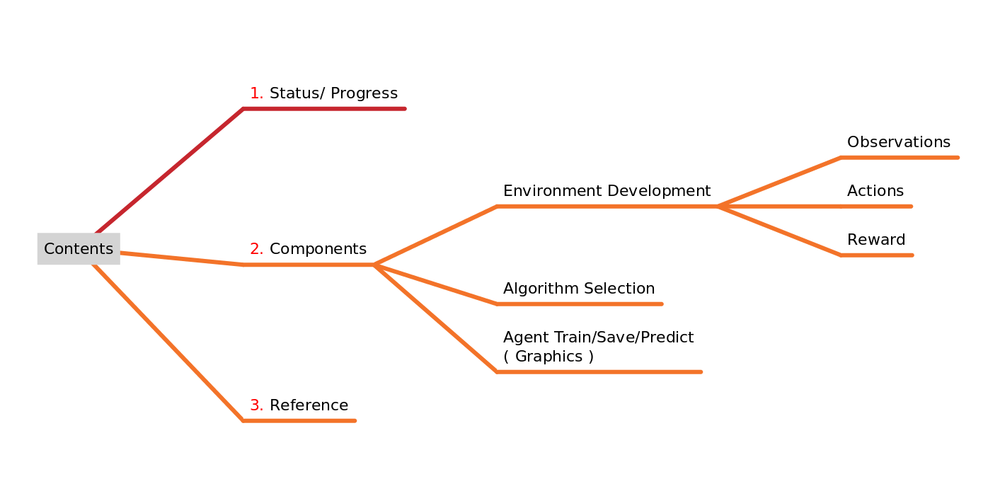
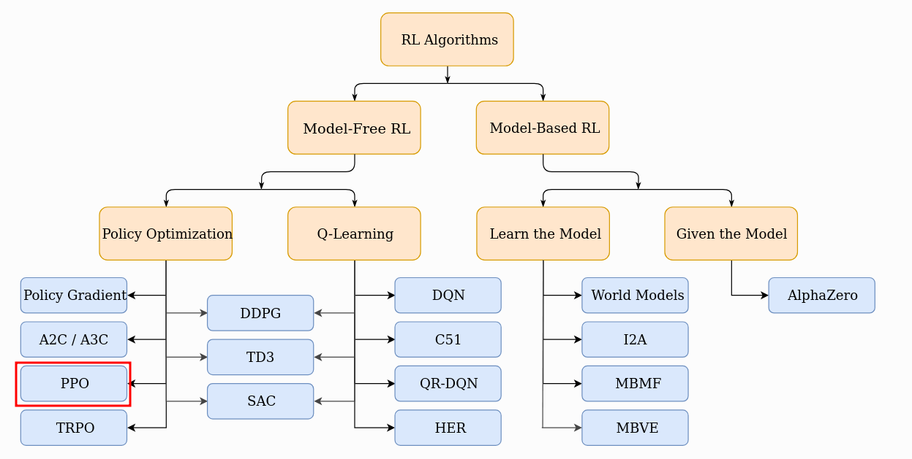
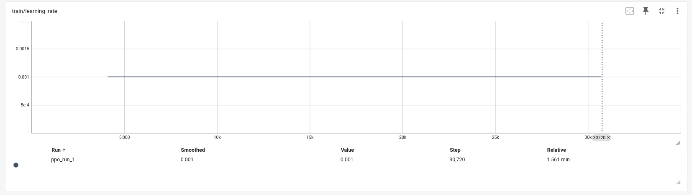
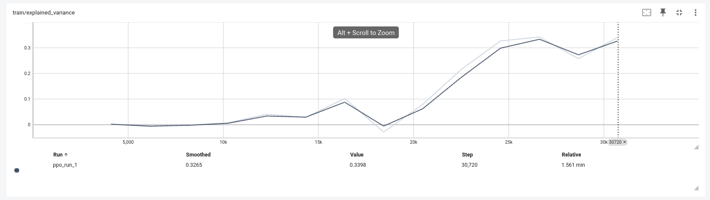
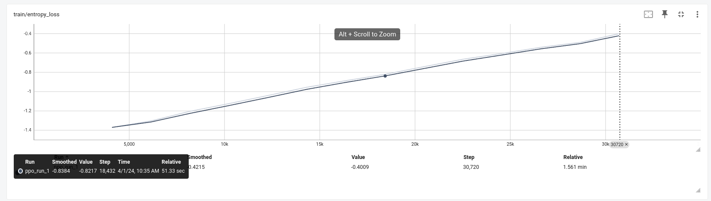
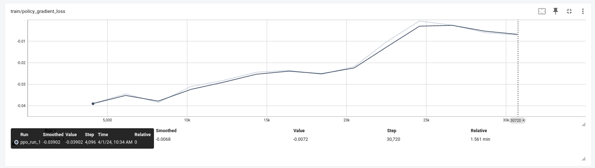
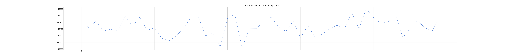
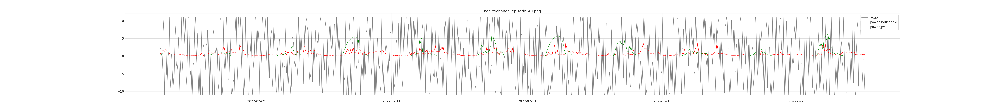

# Training Prosumer Agents with Reinforcement Learning.

***

**>>> Biweekly Report 2.** ( $16^{st} Mar - 31^{st} Mar : 2024$ )

***



***

## 1. Status/ Progress

### Current Iteration

- [x] Environment Development
  - [x] Custom Gymnasium Environment
    - [x] Action Space
    - [x] Observation Space
    - [x] Reward Function
- [x] Algorithm Selection
- [x] Graphics and Tensorboard Logs (Train/ Inference)

### Next Iteration (Plan)

- [ ] RL Agent Implementation
  - [ ] Policies
  - [ ] Parameters
- [ ] Training with Initial Test Environment

---

## 2. Components

Taking feedback from `22.03.2024` into account and updated understanding of the system following changes were made to different components.

### 2.1. Environment Development

2.1.1 **Data Processing**

- During data processing the PV data is inverted by $( * -1 )$ to get the comparitive plot later on as shown in the figure of net exchange in graphics and logs section below.

2.1.2. **Observations**

- Current  space consists of only power required by a household `power household` and power generated by photovolitaics `power pv`, that the agent observes.

- The agent only gets partial observation, current rolling mean of window 3 , at any given timestep.

- The observation are min max scaled $( 0, 1 )$

2.1.3. **Actions Spaces**

- Not many changes were made for action space, except for rescaling the action space suggested by the policy, to original space of (11, -11) for plotting figures. Previously only scaled during calculation of reward.

2.1.4. **Rewards**

The reward is modified to represent cost, i.e. unit of reward as cost, as follows:

- calculate `net_exchange` of energy

- calculate `consumption_cost`

- calculate `sell_cost`

- `total_cost` = `consumption_cost` + `sell_cost`

This cost however, if used as a agent's reward as is, will always be same for every episode, since the net exchange remains the same. since the action also influences the net exchange during charging and discharging, the final Reward Function, Influenced by action is as follows:

- `net_exchange`:  $\text{power household} + \text{power pv} + \text{action}$
- `power_household_cost`: $max(0, \text{net exchange})$ * $\text{energy buy price}$
- `power_sell_cost`: $-1 * min(0, \text{net exchange}) * \text{energy sell price}$
- `final_reward` : $\text{power sell cost} - \text{power household cost}$

### 2.2. Algorithm Selection

*Several Considerations for the selection of an algorithm*

1. **Action Space** : *Continuous Action Space*

2. **Policy Learning Type** : *On policy*

3. **State Space** : *Partially Observable*

4. **Modeling of Environment** : *Model Free*

#### **2.2.1. Action Space**

Since the objective of the agent is to perform charging and discharging action continuously through timesteps. Following are algorithms that could be utilized for such continuous space.

- **Proximal Policy Optimization (PPO)**

  - Well-suited for continuous action spaces like charging/discharging power, good stability and sample efficiency compared to other algorithms

  - Careful hyperparameter Optmiization is needed and not suitable for very large state spaces.

- **Deep Deterministic Policy Gradient (DDPG)**

  - Actor-critic architecture that combines policy learning with value estimation, that handles continuous space effectively, and can learn from off-policy data.

  - Requires training of multiple network( Actor and Critic ), Computationally expensive compared to other algorithms

- **Twin Delayed Deep Deterministic Policy Gradient (TD3)**

  - Variant of DDPG that addresses stability issues and improves learning performance that is effective in continuous action space, which offers more stability compared to DDPG

  - Requires more hyperparameter tuning than DDPG and can be more computationally expensive due to multiple networks and parameters.

- **Soft Actor-Critic (SAC)**

  - It is suitable for continuous action space and focuses on maximizing expected return while considering entropy (encourages exploration) and avoids overfitting to specific data.

  - It can be more complex to implement and tune compared to simpler algorithms and hence requires more parameters tuning effort.

- **Advantage Actor-Critic (A2C)**

  - It handles continuous action spaces and is a simple architecture compared to DDPG or TD3 which can be computationally less expensive

  - It can suffer from high variance in policy updates, that causes potential instability and not suitable for complex environments.

#### **2.2.2.** Policy Learning Type

Since the agent will be directly interacting with the HEMS environment  during training, and the experiences collected will reflect the current policy being learned, the scenario is considered **On-policy**.

#### **2.2.3.** State Space

Since the agent does not have access to all the information about the system, it is consideres **Partially Observable**. A partially observed state space that captures relevant information from current and historical data (through feature engineering).

#### **2.2.4.** Model of Environment

Since all the dynamics of environment are not know so **model-free** algorithm is considered for its simplicity and effectiveness in this dynamic environment. This approach avoids the complexity of building an accurate model for the dynamic HEMS environment. Algorithms like PPO or SAC can learn directly from experience (state, action, reward) without explicitly building a model of the environment.



Fig. 1 Different Reinforcement algorithm classified based on criteriais$_{1}$

**PPO** (from SB3) due to its on-policy learning capabilities, effectiveness with continuous action spaces, and relative ease of implementation.

### 2.3. Agent(Policy) Train/Save/Result (Graphics)

```python
hyper_params: dict = {
    "dataset_len": 0.8 * total_dataset
    "learning_rate": 0.001,
    "total_timesteps": len(dataset_len-1),
    "episode_limit": 50
}
```

Stable baselines 3 has documented some tips and tricks during training algorithms which have also been considered $_{2}$

#### **Training Graphs**

**PPO** for `total timesteps`:

Learning rate is constant



Explained variance



Entropy Loss



Gradient Loss



#### **Inference Graphics**

- Original Series have been divided by `1000` to get Kilo Watt to scale to action space as shown in the following diagrams.

- Following figures only consists of last `1000` observation points from the dataset used for training (0.5*original set).

**PPO** for `episode_limits`:

Accumulated rewards per episode



Net Exchange Episode 1


Net Exchange Episode 25


Net Exchange Episode 50



## 3. References

- [1. ] [Part 2: Kinds of RL Algorithms &mdash; Spinning Up documentation](https://spinningup.openai.com/en/latest/spinningup/rl_intro2.html)
- [2. ] [Reinforcement Learning Tips and Tricks &mdash; Stable Baselines3 2.3.0 documentation](https://stable-baselines3.readthedocs.io/en/master/guide/rl_tips.html)
