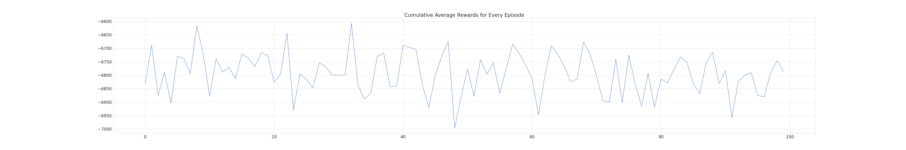

# Training Prosumer Agents with Reinforcement Learning.

***

**>>> Biweekly Report 3.** ( $1^{st} Apr - 24^{th} Apr : 2024$ )

***


***

## 1. Status/ Progress

### Current Iteration

- [x] Environment Development

- [x] Battery module

- [x] RL Agent Integration

- [x] Graphics and Logs

### Next Iteration (Plan)

- [ ] simplified n/w with ppo (to find source of issue that reward graph not being on a trend)
- [ ] environment wrappers for observation, actions, rewards, etc.
- [ ] vectorized environment for parallel learning

---

## 2. Components

Taking feedback from weekly catchups into account and updated understanding of the system following changes were made to different components.

### 2.1. Environment Development

2.1.1 **Data Processing**

- Min-Max Scaling was replaced with Z-score normalization( Data inputs to have $\mu$ = 0, $\sigma$ = 1 )
- `Power PV` and `Power Household` were divided by `1000` early during processing to convert them to Kilowatt.

2.1.2. **Observations**

- In addition to the already observable `Power PV` and `Power Household`, a battery state of charge was added to an observation from a battery module, as explained below.

2.1.3. **Actions Spaces**

- Since the resulting scaled action [-11, 11] is of Kilowatthour and the input sample frequency is of quarter hour, the action is divided by `4` before it is added as energy content.

2.1.4. **Rewards**

- Charging and Discharging efficiency is removed and moved to the battery module so as to only affect the battery soc and not the reward itself.

- Rest of the reward calculation remains as is:

```python
net_exchange = household demand + pv generated + action(charge/discharge)
buy_cost = max(0, net_exchange) * buy_price
sell_cost = min(0, net_exchange) * sell_price
reward = (buy_cost + sell_cost) * -1
```

- $\text{total cost} * -1$, $\because$ pv generated is (-ve) in the dataset.

2.1.5 **Modularization**

- The environment is moved as a `hems-env` module that can be installed `pip install -e hems-env` locally and registered directly with gymnasium make `env = gym.make("hems_env/HouseholdEnv-v0", **kwargs)`.

### 2.2. Battery Module

- A battery is separated as suggested from the environment, moved with other battery relavant operations such as action efficiency, energy/unit conversion, and to get current state of charge.

### 2.3. Agent

- Algorithm in use : PPO (same as before)
- Policy Network used for sampling actions
  - Fully Connected two layer MLP with 64 units per layer.
  - Optimizer : Adam
  - Activation : (TanH)
  - Output : Action b/w [-1, 1].

### 2.4. Graphics/ Logs

```python
hyper_params: dict = {
    "dataset_len": 0.8 * total_dataset
    "learning_rate": 0.001,
    "total_timesteps": 60000
    "episode_limit": 100
}
```

**Value Loss**


**Policy Gradient Loss**


**Net Exchange Graph**

Episode 0


Episode 50


Episode 99


**Reward x Net Exchange**

Episode 0


Episode 50


Episode 99


**Action x State of Charge**

Episode 0


Episode 50


Episode 99


**Cumulative Reward Per Episode**



## 5. References

- [1. ] [Policy Networks; Stable Baselines3 2.3.0 documentation](https://stable-baselines3.readthedocs.io/en/master/guide/custom_policy.html)
